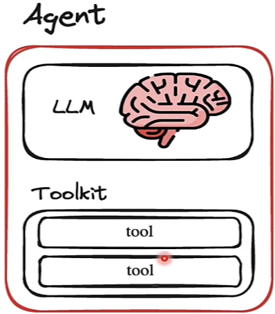
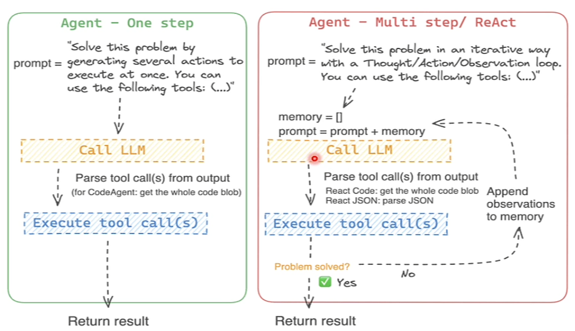

## Agentes e Tools (ferramentas)

As LLMs encontram dificuldades com determinadas tarefas que envolvem lógica, cálculo matemáticos ou pesquisa. Uma das formas de resolver este problema é integrar a LLM a um conjunto de ferramentas (tools). Esse sistema com a integração é chamada de **Agente LLM**.

Existe uma integração com o ambiente externo, pois o agente usa um motor de raciocínio para determinar quais ações tomar para obter um resultado. Por exemplo, pode ser integrado com os mecanismos de pesquisa da Google e a Wikipedia.

- Os agentes possuem um nível maior de capacidade de raciocínio por terem acesso a ferramentas externas.
- Podem selecionar ferramentas conforme necessário, em uma sequência que considerem adequada.
- O próprio agente pode selecionar a ordem das ações a serem executadas utilizando as ferramentas.

### Ferramentas (tools)

São os principais componentes de agentes que realizam tarefas individuais.

As tools são basicamente apenas métodos/classes aos quais o agente tem acesso que podem fazer coisas como: fazer uma pesquisa na web, interagir com APIs, executar uma consulta em um banco de dados, etc.

Uma coleção de ferramentas no LangChain é chamada de *Toolkit*.

### Vantagens dos agentes

- **Flexibilidade:** Podem ajustar suas ações com base nos resultados intermediários, ou seja, eles podem ser mais adaptáveis a mudanças no contexto.
- **Raciocínio dinâmico:** Utilizam modelos de linguagem que podem determinar a sequência de ações, o que permite a tomada de decisões em tempo real e maior inteligência nas interações.
- **Manutenção simplificada:** Menos necessidade de codificação manual, pois o modelo de linguagem que vai guiar as ações.
- **Capacidade de interação:** Podem integrar múltiplas ferramentas e fontes de informação, recuperados por meio de diferentes tools.
- **Produção de ações:** Enquanto os modelos de linguagem sozinhos apenas produzem texto, os agentes podem invocar ferramentas e realizar ações com base nas instruções fornecidas pelo modelo.
- **Adequação a tarefas complexas:** São mais eficazes em lidar com interações complexas em contextos mais sensíveis.
- **Realimentação de resultados:** Os resultados das ações podem ser realimentados no modelo para determinar se são necessárias mais ações ou se a tarefa pode ser concluída.

Com isso, podemos concluir que os agentes possuem um mecanismo de raciocínio mais inteligente do que a utilização simples de um modelo de linguagem.

## Chain-of-thought - Cadeia de pensamento

- Uma das maneiras de resolver o problema de raciocínio complexo em LLM é usar o prompting Chain-Of-Thought (cadeia de pensamento).
- O raciocínio complexo pode ser desafiador mesmo para LLMs maiores, especialmente em tarefas que incluem múltiplas etapas.
- Para alcançar sua tarefa, agentes podem usar várias iterações do ciclo de: **Percepção** -> **Reflexão** -> **Ação**.

Essa técnica divide problemas complexos em etapas intermediárias. No prompt do modelo é adicionado a cadeia de pensamento (como fosse a linha de raciocínio) para a LLM chegar a uma resposta específica. Isso ajuda o modelo a "pensar como um humano", pois produz uma resposta correta e transparente que explica todas as suas etapas de raciocínio.

### ReAct (Reasoning and Action - Raciocínio e atuação/ação)

O ReAct é um framework que permite que a LLM planeje e execute essas etapas de raciocínio. É uma abordagem para a construção de agentes.

- No prompt, descrevemos o modelo, quais ferramentas ele pode usar, e pedimos que ele pense "passo a passo" (comportamento de cadeia de pensamento) para planejar e executar suas próximas ações de forma a alcançar a resposta final.
- Permite que LLMs realizem raciocínio e ações específicas para determinadas tarefas.
- Combina a teoria do raciocínio em cadeia com o planejamento de ações, ou seja, melhora o desempenho em várias tarefas e também ajuda a superar problemas de alucinações.

**Processo iterativo do ReAct:**
- Para resolver perguntas complexas, a LLM **adota um processo iterativo**.
- Primeiramente, gera um pensamento sobre o problema e identifica uma ação a ser tomada. As ações podem incluir chamadas de API, como buscar dados na Wikipedia.
- A LLM observa os resultados das ações e, se necessário, gera novos pensamentos e ações até encontrar a resposta.
    - Enquanto o problema não é resolvido, as respostas parciais são adicionadas na memória.

Por baixo dos panos, o ReAct é um **prompt template bem específico**, que dirá como a LLM deve se comportar.