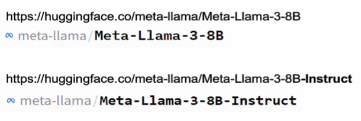
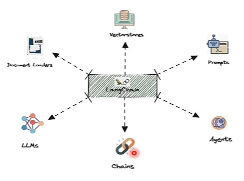
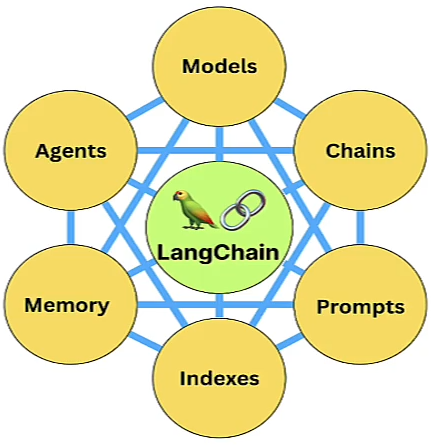
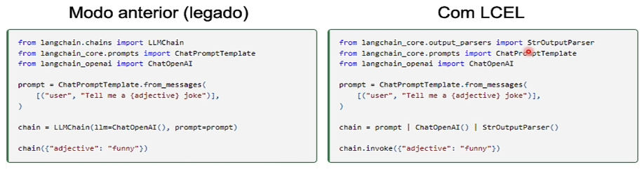

# LLM_Learning

Repositório com a finalidade de estudar Large Language Models (LLMs) - Grandes Modelos de Linguagem.

### LLM com Hugging Face

Hugging Face é um repositório de código aberto que oferece modelos, datasets e ferramentas.

É especialmente conhecido por sua biblioteca Transformers, projetada para aplicações de PLN (Processamento de Linguagem Natural).

Além da biblioteca Transformers, há milhares de modelos de linguagem disponíveis gratuitamente no Hugging Face. Se destacou como um ator principal no ecossistema de LLMs oferecendo uma plataforma e ferramentas de código aberto que simplificam a utilização desses modelos.

#### Tipos de modelos

Ao navegar pelos repositórios de modelos de IA Generativa (como o Hugging Face) observará modelos listados com os sufixos _'instruct'_ ou _'chat'_. É importante conhecer essas terminologias, pois terá resultados diferentes de acordo com os tipos de modelos utilizados.

- **Modelos Base (Base Models)** - Modelos base passam apenas pelo pré-treinamento e completam textos com as palavras mais prováveis.
- **Modelos Ajustados para Instruções (Instruct-tuned)** - Passam por uma etapa adicional de ajustes para instruções, melhorando a capacidade de seguir comandos específicos.
- **Modelos de Chat (Chat Models)** - Foram ajustados para funcionar em Chat Bots, portanto, podem ser mais apropriados para conversas.

A versão **"Instruct"** foi ajustada para seguir instruções fornecidas. Esses modelos "esperam" ser solicitados para fazer algo.

- O modelo recebe instruções.

Modelos com o sufixo **"Chat"** foram ajustados para funcionar em chatbots, "esperando" estar envolvidos em uma conversa com diferentes atores.

- É propriamente um chatbot.

Em contraste, **modelos não ajustados para instruções (modelos base)** simplesmente geram uma saída que continua a partir do prompt.

- A ideia de simplesmente completar textos.
- São bons em prever palavras subsequentes.
- Por exemplo, para a palavra "O céu é", este tipo de modelo provavelmente completará com "azul" porque é a sequência mais comum.
- Portanto, _seu comportamente reflete essas estatísticas_, não uma falta de inteligência por parte do modelo.

Para criar chatbots, implementar RAG ou usar agentes, use modelos 'instruct' ou 'chat'. Porém, em caso de dúvida, use um modelo 'instruct' para iniciar o teste.



Baseado na imagem acima, dois modelos são apresentados: Um modelo base e o outro do tipo instruct. Para ter o comportamento semelhante ao ChatGPT é necessário utilizar o modelo com a terminologia 'instruct'.

### LLM com LangChain

Atualmente, LangChain é uma das ferramentas de LLM mais utilizadas.

**Características:**

- É uma biblioteca de código aberto, projetada para facilitar a integração de LLMs.
- Lançado em Outubro de 2022.
- Fornece uma sintaxe unificada que simplifica o uso de LLMs em diferentes contextos, como chatbots, análises de texto e sistemas de perguntas e respostas.
- Torna mais fácil combinar LLMs com outras ferramentas e serviços (é mais simples que as bibliotecas do HuggingFace).
- É uma solução muito importante para deixar as LLMs "programáticas" e **criar aplicações próprias**.

#### Componentes do LangChain





- **Modelos:** Oferece uma interface padrão para interações com uma ampla gama de LLMs.
- **Prompts:** Ferramentas para simplificar a criação e tratamento de prompts dinâmicos.
- **Chains (Corrente, Cadeia ou Sequência):** Interface padrão para encadear LLMs em aplicações complexas, permitindo a ligação entre múltiplos modelos ou outros módulos especialidados.
- **Memória:** Módulos que permitem o gerenciamento e alteração de conversas anteriores, **essencial para chatbots** que precisam **relembrar interações passadas** para **manter a coerência**.
- **Agentes:** Equipados com um kit de ferramentas abrangente, podem escolher quais ferramentas usar para resolver o problema com base nas informações do usuário.
- **Índices:** Métodos para organizar documentos (como documentos de texto, PDFs, etc) de forma a facilitar a interação eficaz com LLMs (interação com documentos).

#### Chains (Correntes)

Leva o próprio nome da ferramenta.

As chains permitem ligar diversos prompts para construir aplicações complexas, quebrando problemas maiores em partes menores.

Elas funcionam ao **encadear componentes**, onde a saída de um se torna a entrada do próximo, criando uma sequência lógica de operações.

As chains são estáticas (hard-coded), esperando sempre um tipo específico de entrada.

```py
    chain = prompt | llm | StrOutputParser()
```

O pipe `|` seria como fosse uma concatenação.

Nesse exemplo acima, o prompt de texto do usuário é enviado como entrada para o modelo (llm) e a saída do modelo é concatenada com a classe StrOutputParser que é utilizada para formatar os resultados. Com isto temos uma corrente.

A ideia de fazer conexão entre os componentes é a base da linguagem de expressão do Langchain, que é chamada de **LCEL**.

#### LCEL

A Linguagem de Expressão de Langchain (LCEL - LangChain Expression Language), é uma maneira declarativa de encadear os componentes da biblioteca.

É uma abstração de alguns conceitos interessantes do Python em um formato "minimalista" para construir cadeias de componentes LangChain.

Permite um desenvolvimento rápido de chains, pois a sintaxe é bastante prática e flexível (concatenação com o pipe `|`). Além disso, permite incorporar recursos avançados como streaming, assíncrono, execução paralela e muito mais.



### Dicas uteis para liberar espaço do WSL:

- [A Forma Correta de Liberar Espaço no WSL 2](https://www.tabnews.com.br/freitaschz/a-forma-correta-de-liberar-espaco-no-wsl-2)
